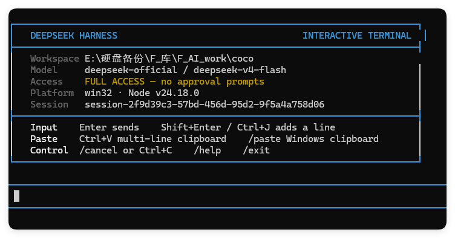

# DeepSeek Harness TUI — DSH Plugin

English | [中文](README.md)

A lightweight and fast terminal UI plugin for [DeepSeek Harness (DSH)](https://github.com/deepseek-ai/deepseek-harness). It connects directly to DSH's agent, tool, permission, and Session services instead of recreating the Harness runtime.

**DSH-TUI** is playfully nicknamed **“单身汉 TUI”** in Chinese, based on the sound of the DSH initials.



## Why this plugin

- **Lightweight** — one focused terminal presentation layer with no Web application runtime.
- **Fast workflow** — responsive multi-line input, direct keyboard controls, and compact tool summaries.
- **Native DSH integration** — uses DSH's scoped tools, approvals, agent lifecycle, and durable Session log directly.

## Requirements

- Node.js 22.19 or later, or Node.js 24+
- pnpm 11+
- An existing DeepSeek Harness `0.1.0-rc.6` installation
- A model credential already configured in DSH, either through its credentials service or the launching environment

## Develop from this checkout

```powershell
pnpm install
pnpm run build
pnpm test
dsh plugin --profile tui add .
dsh --profile tui
```

The package consumes published `@deepseek-ai/*` packages at `0.1.0-rc.6`; it has no monorepo-relative or `workspace:^` dependency.

## Input and commands

- Enter sends the current message.
- Shift+Enter or Ctrl+J inserts a newline.
- Ctrl+V accepts bracketed multi-line paste; `/paste` reads the Windows clipboard directly.
- `/cancel` or Ctrl+C cancels the active task.
- `/verbose` toggles bounded tool details for subsequent calls.
- `/tool N` prints the retained input and result for call number `N`.
- `/help` lists commands; `/exit` or `/quit` closes the session.

Tool calls show numbered summaries by default and failed calls expand automatically. `toolDetailMaxLines` and `toolDetailMaxCharacters` default to 80 lines and 8,000 characters. `toolDetailHistoryLimit` keeps the latest 200 calls available to `/tool N`; older details leave process memory while complete values remain in the DSH Session log.

## Scope

This repository owns only the terminal presentation plugin. DSH owns model routing, tools, permissions, persistence, and agent execution. The TUI is line-oriented and does not provide the Web client's graphical cards, session navigation, or full-screen scrollback.

## License

[MIT](LICENSE)
