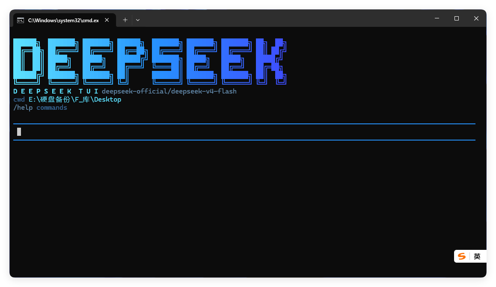

# DeepSeek Harness TUI — DSH Plugin

English | [中文](README.md)

A minimalist terminal UI plugin for [DeepSeek Harness (DSH)](https://github.com/deepseek-ai/deepseek-harness). It keeps the complete agent and tool workflow while moving routine execution activity out of the way, leaving the terminal focused on your input and the model's final answer.

**DSH-TUI** is playfully nicknamed **“单身汉 TUI”** in Chinese, based on the sound of the DSH initials.



## Minimal by design: less process, more answer

The design principle is simple: **tools should keep working without taking over the screen.** Less routine status output means clearer context, less scrolling, and a conversation that is easier to read from beginning to end.

- **Gradient identity** — the `DEEPSEEK` wordmark uses a true-color cyan-to-deep-blue gradient for a distinct, consistent terminal identity.
- **Compact runtime context** — only the active model, working directory, and `/help` hint remain below the wordmark; Session ID, platform version, permission mode, and the shortcut panel no longer crowd the dashboard.
- **Deep-sea palette** — input borders, status labels, paths, and the thinking indicator share a restrained ocean palette designed for extended terminal use.
- **Stable path colors** — file and directory references receive deterministic colors, making targets easier to find in logs and retained tool details.
- **Answer-first conversation flow** — successful tool calls stay hidden by default, so the terminal primarily shows user input and model responses; failures still surface as one compact line instead of disappearing silently.
- **Details on demand** — minimal does not mean lost information. `/verbose` reveals subsequent tool output, `/tool N` opens retained call details, and the complete record remains durable in the DSH Session log.
- **Private thinking state** — a concise `[thinking]` indicator appears during model reasoning without printing internal reasoning content.

This is a deliberate tradeoff: less distraction, not less capability. DSH continues to own model routing, tool execution, approvals, the agent lifecycle, and Session persistence.

## Why this plugin

- **Lightweight** — one focused terminal presentation layer with no Web application runtime.
- **Fast workflow** — responsive multi-line input, direct keyboard controls, and tool activity that stays out of the conversation by default.
- **Deep-sea visual language** — the startup dashboard, status labels, path references, and thinking state share one restrained ocean palette.
- **Native DSH integration** — uses DSH's scoped tools, approvals, agent lifecycle, and durable Session log directly.

## Requirements

- Node.js 22.19 or later, or Node.js 24+
- pnpm 11+
- An existing DeepSeek Harness `0.1.0-rc.6` installation
- A model credential already configured in DSH, either through its credentials service or the launching environment

## Develop from this checkout

```powershell
pnpm install
pnpm run build
pnpm test
dsh plugin --profile tui add .
dsh --profile tui
```

The package consumes published `@deepseek-ai/*` packages at `0.1.0-rc.6`; it has no monorepo-relative or `workspace:^` dependency.

## Input and commands

- Enter sends the current message.
- Shift+Enter or Ctrl+J inserts a newline.
- Ctrl+V accepts bracketed multi-line paste; `/paste` reads the Windows clipboard directly.
- `/cancel` or Ctrl+C cancels the active task.
- `/verbose` toggles bounded tool output for subsequent calls.
- `/tool N` prints the retained input and result for call number `N`.
- `/help` lists commands; `/exit` or `/quit` closes the session.

Tool calls are quiet by default; failed calls print only one compact line. `/verbose` shows numbered summaries and bounded details for subsequent calls, and `/tool N` can inspect recently retained inputs and results. `toolDetailMaxLines` and `toolDetailMaxCharacters` default to 80 lines and 8,000 characters. `toolDetailHistoryLimit` keeps the latest 200 calls available to `/tool N`; older details leave process memory while complete values remain in the DSH Session log.

## Scope

This repository owns only the terminal presentation plugin. DSH owns model routing, tools, permissions, persistence, and agent execution. The TUI is line-oriented and does not provide the Web client's graphical cards, session navigation, or full-screen scrollback.

## License

[MIT](LICENSE)
